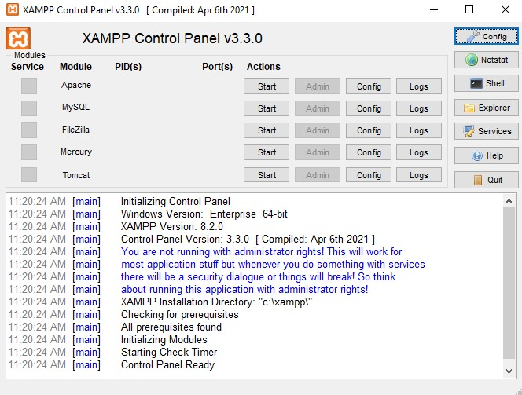

# Basic-e-ecommerce

A basic e-commerce site built using PHP, Alpine.js and Bulma framework.

## Getting Started

1. Install [XAMPP](https://www.apachefriends.org/download.html) if you haven't have one on your machine, as this *web server solution stack package* will get you up and ready for developing **PHP** easily.

2. Locate your copies of *XAMPP* and enter the directory, search for *htdocs* and clone this respository inside the *htdocs* directory.

    ```bash
    git clone https://github.com/AlstonChan/Basic-E-Commerce.git
    ```

3. This application will not work properly without configuring the host address in **Apache** and your local *hosts* file. To do this, first open up your *XAMPP* control panel, you should see a interface like the figure below.

    

    Click **Config** at the *Apache* row and select *`<Browse> [Apache]`* from the dropdown. Your file explorer should be opened, go to *`conf`* -> *`extra`* and open up **httpd-vhosts.conf** using your favourite text editor.
    Scroll to the end of the file and paste the following line:

    ```conf
    <VirtualHost *:80>
        ##ServerAdmin webmaster@dummy-host.example.com
        DocumentRoot "C:/xampp/htdocs/basic-e-commerce/public"
        ServerName ecommerce.local
        ##ServerAlias www.dummy-host.example.com
        ##ErrorLog "logs/dummy-host.example.com-error.log"
        ##CustomLog "logs/dummy-host.example.com-access.log" common
    </VirtualHost>
    ```

    If you want to have a default host name for your **htdocs**, paste the following line:

    ```conf
    <VirtualHost *:80 *:443>
        DocumentRoot "C:/xampp/htdocs"
        ServerName default.local
    </VirtualHost>
    ```

4. Next, navigate to **`C:\Windows\System32\drivers\etc`**. You should see a *hosts* file without any extension, open it with any editor of your choices and paste this at the last line of the file:

    ```
    127.0.0.1 ecommerce.local
    ```

    If you have paste the default host name line at the previous steps, then you should also paste this in:

    ```
    127.0.0.1 default.local
    ```

5. Start your *Apache* web server and *MySQL* database in the *XAMPP* control panel. Then, open up your web browser and enter **<http://ecommerce.local>**, you should see the page up and running with the link functioning flawlessly.

## Sass compilation

To compile sass to css, you have to install <https://sass-lang.com/dart-sass>, check out the link for installation steps. To compile sass automatically after saving, enter the following line in *lib/bulma* for it to work.

```bash
sass --watch bulma.sass:../../public/css/bulma.css --style compressed
```

This will compile *sass* to *css* on each saving in a compressed version.
